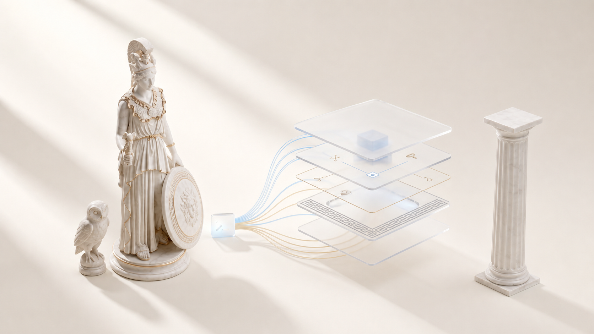

# Athena

Athena заново собирает вашу рабочую среду на чистом Mac: правила, скиллы, реестры и проекты возвращаются на место.

[English](README.md) · [中文](README.zh.md)

[](LICENSE) [](https://github.com/zarubinvibe/athena/stargazers) [](https://github.com/zarubinvibe/athena) [](https://github.com/zarubinvibe/athena#olympuz-family)

<p align="center"></p>

<!-- owner-welcome:start -->

> Привет. Я слишком много раз переносил настройку на новый Mac руками и каждый раз забывал половину: правила, скиллы, хуки, реестры, клонированные проекты.
>
> Athena держит эту настройку как программу, а не как память. Если она вернёт вам среду за вечер, забирайте и делайте своей.
>
> — Филипп Зарубин

<!-- owner-welcome:end -->

## Оглавление

- [Что это](#что-это)
- [Зачем это нужно](#зачем-это-нужно)
- [Главное преимущество](#главное-преимущество)
- [Как это работает](#как-это-работает)
- [Быстрый старт](#быстрый-старт)
- [Простое сравнение](#простое-сравнение)
- [Простые слова](#простые-слова)
- [Безопасность и приватность](#безопасность-и-приватность)
- [Ограничения](#ограничения)
- [Звезда и вклад](#звезда-и-вклад)

<!-- beginner-readme:start -->

## Что это

Athena это переносимая агентная среда. Всё, что вы месяцами настраивали, она держит как версионные шаблоны и проверки, а потом собирает слой за слоем на другой машине. Не список инструкций, а программа, которую можно запустить второй раз.

## Зачем это нужно

Настройка растёт полгода: конфиги, скиллы, хуки, реестры, клонированные проекты. Новый ноутбук стирает её за вечер, и половина не вспоминается никогда. Athena превращает эту настройку в то, что собирается заново, пока вы пьёте кофе.

## Главное преимущество

**Главное преимущество:** среда собирается программой, а не по памяти.

**Почему это лучше:** Любой слой можно прогнать повторно, ничего не сломав, а `--dry-run` показывает весь план до того, как запишется первый файл.

## Как это работает

Bootstrap идёт слоями по порядку. Можно посмотреть план, прогнать один слой или собрать всё сразу.

<!-- workflow-diagram:start -->

```text
  ┌────────────┐   ┌────────────┐   ┌────────────┐
  │ Подготовка │ ▶ │ Выбор      │ ▶ │ Прогон     │
  └────────────┘   └────────────┘   └────────────┘
         ▼
  ┌────────────┐   ┌────────────┐   ┌────────────┐
  │ Сборка     │ ▶ │ Проверки   │ ▶ │ Отчёт      │
  └────────────┘   └────────────┘   └────────────┘
```

<!-- workflow-diagram:end -->

| Этап | Что происходит |
|---|---|
| 1. Подготовка | Сначала базовые инструменты: Xcode CLT, Homebrew, chezmoi, Node, Git |
| 2. Выбор | Интервью выбирает интеграции и личные слои |
| 3. Прогон | Полный план печатается до того, как что-то запишется |
| 4. Сборка | Инструменты, dotfiles, плагины, реестр, проекты, база знаний, launchd |
| 5. Проверки | Синтаксис shell, шаблоны, контракты, чистый рендер |
| 6. Отчёт | Локальный статус маршрутизации и недельный HTML-отчёт |

### Шаг 1: Подготовьте Mac

`preinstall.sh` ставит базовые инструменты и закреплённую версию Claude Code CLI, а репозиторий оставляет в `~/athena`. Скрипт можно прочитать до запуска.

**Что получится:** Mac, на котором может пойти вся остальная настройка.

### Шаг 2: Выберите, что вам нужно

Запустите Claude Code в репозитории и введите `/setup-os`. Он спросит, какие интеграции и личные слои нужны, и запишет выбранную конфигурацию. Пропущенное добавляется позже.

**Что получится:** файл конфигурации, который описывает вашу машину, а не чужую.

### Шаг 3: Посмотрите план целиком

`./bootstrap.sh --dry-run` печатает, что сделал бы каждый слой. Во время просмотра ничего не ставится, не клонируется и не перезаписывается.

**Что получится:** читаемый план, который можно принять или поправить до настоящего запуска.

### Шаг 4: Соберите слои

Слои идут по порядку: базовый Homebrew, необязательные инструменты, слитые шаблоны chezmoi, плагины Claude Code, реестр возможностей, клоны проектов, необязательная база знаний, хранилище секретов и фоновые задания.

**Что получится:** рабочая среда, где агенты, скиллы и проекты снова на месте.

### Шаг 5: Прогоните проверки

Те же проверки, что гоняет workflow репозитория, доступны локально: shellcheck, набор smoke и чистый рендер во временный каталог.

**Что получится:** зелёные проверки или названные файл и строка, которые надо починить.

### Шаг 6: Следите за состоянием

После установки агентского слоя команда статуса читает локальные записи и краснеет, если задание упало и не было повторено. Недельная команда собирает из тех же данных HTML-отчёт.

**Что получится:** короткий ответ на вопрос «не сломалось ли что-то тихо за неделю».

## Быстрый старт

Athena работает на macOS. Нужны админский доступ и сеть для Homebrew, npm и Git.

```bash
git clone https://github.com/zarubinvibe/athena.git "$HOME/athena"
cd "$HOME/athena"
less preinstall.sh
./preinstall.sh
```

Спешите на чистом Mac? Запустите тот же версионный скрипт напрямую: `curl -fsSL https://raw.githubusercontent.com/zarubinvibe/athena/main/preinstall.sh | bash`. Совсем нет Git? Возьмите [ZIP](https://github.com/zarubinvibe/athena/archive/refs/heads/main.zip) и распакуйте. Дальше откройте Claude Code в этой папке и введите `/setup-os`. Первый раз? Откройте проект в Claude Code и запустите `/athena-setup`: установка пройдёт разговором, слой за слоем, с сухим прогоном до первой записи.

Делаете это впервые? [Онбординг](docs/ONBOARDING.ru.md) проводит весь первый запуск по шагам и говорит, что видно после каждой команды.

**Что получится:** базовые инструменты стоят, репозиторий лежит в `~/athena`, а `/athena-setup` готов спросить, что вам нужно.

## Простое сравнение

| Вариант | Когда подходит | Что получаете | Минус |
|---|---|---|---|
| **Athena** | Нужна вся агентная среда, а не только dotfiles | Упорядоченные слои, сухой прогон, реестр, проекты, проверки | Только macOS |
| Настройка руками | Одна машина и один раз | Полный контроль и ничего лишнего | День работы и никакой повторяемости |
| Только репозиторий dotfiles | Нужны в основном конфиги shell и редактора | Просто и переносимо | Не возвращает агентские скиллы, реестры и проекты |
| Облачная среда разработки | Работа идёт в контейнере | Одинаковая среда для команды | Локальная машина и локальные агенты остаются ненастроенными |

## Простые слова

| Слово | Простое значение |
|---|---|
| Repository | Папка проекта, которую хранит и версионирует Git |
| Terminal | Окно, куда вы вводите команды |
| Command | Одна инструкция компьютеру |
| Branch | Отдельная линия изменений, которая не трогает `main` |
| Pull Request | Просьба проверить ваше изменение и принять его |
| Layer | Один упорядоченный шаг настройки, который можно безопасно повторить |
| Dry run | Просмотр плана без единого изменения на диске |

## Безопасность и приватность

- Доступ к файлам: слои пишут в домашнюю папку и в пути, названные в вашей конфигурации.
- Shell и сеть: установка запускает Homebrew, npm, Git, chezmoi и launchd и тянет указанные репозитории.
- Секреты: значения живут в Keychain macOS или `~/.secrets`, но не в версионных манифестах и шаблонах.
- Подтверждения: `/setup-os` спрашивает про необязательные части, прямой запуск bootstrap идёт по конфигурации без вопросов.
- Ограждения: встроенные хуки блокируют известные опасные шаблоны, но это не системный sandbox.
- Телеметрия: собственные скрипты Athena ничего не отправляют. У сторонних инструментов свои правила.
- Восстановление: `athena-update` делает резервную копию и показывает diff до применения изменений.

Прежде чем запускать Athena на машине с важными данными, прочитайте [SECURITY.md](SECURITY.md).

## Ограничения

Статус: публичная эталонная реализация для macOS. Проверки закрывают синтаксис, шаблоны, гигиену и чистый рендер.

- Только macOS: запросы Homebrew, окна Xcode и поведение launchd зависят от платформы.
- Первая установка на чистом Mac всё ещё требует ручного чек-листа приёмки.
- Тест чистой комнаты рендерит во временные папки и не заменяет настоящую установку.
- Приватные репозитории, доступы и личные знания ваши, публичный клон их не проверяет.
- Версии сторонних инструментов и способы входа меняются по своему расписанию.

Глубже: [полный разбор](docs/DETAILS.ru.md), [описание возможностей](docs/FEATURES.en.md), [контракт файловой системы](rules/structure.md), [дорожная карта](specs/00-roadmap.md), [живая приёмка](smoke/live-acceptance.md).

## Звезда и вклад

Пригодилось? Поставьте Athena звезду: [https://github.com/zarubinvibe/athena](https://github.com/zarubinvibe/athena). Это секунда, а от неё зависит, найдут ли проект другие люди.

Хотите что-то поправить? Путь короткий: сделайте fork, заведите ветку, оформите commit, отправьте push и откройте Pull Request. Не отправляйте push прямо в `main`: релизный gate его отклонит.

Нашли ошибку? Заведите issue на [https://github.com/zarubinvibe/athena/issues](https://github.com/zarubinvibe/athena/issues) и напишите, что запускали и что получилось.

<!-- beginner-readme:end -->

<!-- pantheon-family:start -->
## Семья Olympuz

Это один из публичных [проектов семьи Olympuz](https://github.com/zarubinvibe/athena#olympuz-family). Из таблицы можно открыть репозиторий или сразу скачать исходники в ZIP.

| Тип | Название | Что внутри | Скачать |
|---|---|---|---|
| проект | Athena | Переносимая агентная ОС: разворачивает рабочую среду Claude и Codex на новом Mac. | [Репозиторий](https://github.com/zarubinvibe/athena) · [ZIP](https://github.com/zarubinvibe/athena/archive/refs/heads/main.zip) |
| проект | Helioz | Конвейер работы агентов 24/7 с проверяемыми отметками готовности и ночными решениями по цели владельца. | [Репозиторий](https://github.com/zarubinvibe/helioz) · [ZIP](https://github.com/zarubinvibe/helioz/archive/refs/heads/main.zip) |
| проект | Mnemazine | Локальная система памяти: превращает сырьё в проверенные знания для повторного использования. | [Репозиторий](https://github.com/zarubinvibe/mnemazine) · [ZIP](https://github.com/zarubinvibe/mnemazine/archive/refs/heads/main.zip) |
| проект | Themis | Многоагентный помощник по российским судебным делам с локальным OCR и советом из пяти юристов. | [Репозиторий](https://github.com/zarubinvibe/themis) · [ZIP](https://github.com/zarubinvibe/themis/archive/refs/heads/main.zip) |
| проект | Zeuz | Фабрика многоагентных workflow: собирает систему с правилами, гейтами, наблюдаемостью и replay. | [Репозиторий](https://github.com/zarubinvibe/zeuz) · [ZIP](https://github.com/zarubinvibe/zeuz/archive/refs/heads/main.zip) |
<!-- pantheon-family:end -->

## Лицензия

MIT. Текст в файле [LICENSE](LICENSE).
